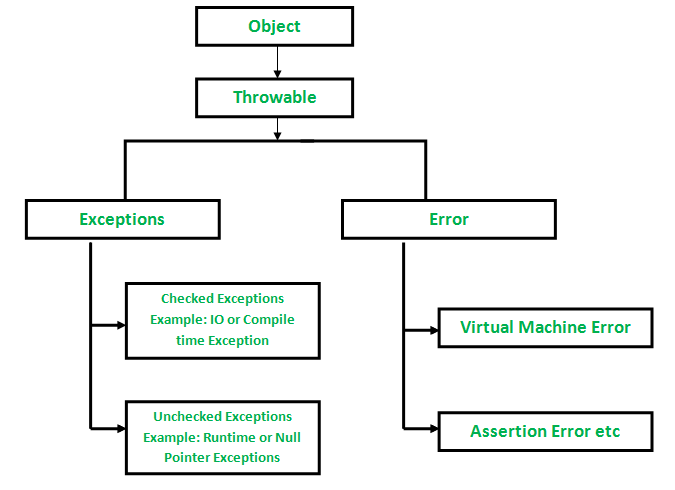

# Database - mySQL

## [JDBC Connector](https://github.com/vellita/ScalaWork/tree/master/NewProject2/src/main/scala/com/wiley/EighteethOct/JdbConnectorwithDB)

Use of java.sql to connect to my local mySQL database.
This class allows us to read from the database tables by using DriveManager
and Connection
To write to the sql database we need to use [PreparedStatement](https://github.com/vellita/ScalaWork/blob/master/NewProject2/src/main/scala/com/wiley/NineteethOct/InsertSql.scala) 

Require a mysql java dependency

libraryDependencies += "mysql" % "mysql-connector-java" % "8.0.30"

## [scalikejdbc](https://github.com/vellita/ScalaWork/blob/master/NewProject2/src/main/scala/com/wiley/NineteethOct/trySQLinsett.scala)

Using a different dependency we are able to easily connect to the database using a session

To execute sql queries we need to write the statement and put .execute.apply() when creating a table.
Put .update.apply() when inserting a record into the table and other such as 
.list.apply() can be used to retrieve items from query in a list format.
apply() allows us to execute sql queries in a simpler manner compared to the JDBC Connector

---

---
# [Tuples](https://github.com/vellita/ScalaWork/tree/master/NewProject2/src/main/scala/com/wiley/EighteethOct/Tuples)

In scala tuples can contain elements of different datatypes
but is not a collection as it does not inherit from a collection class ot trait.
pattern matching can be used to identify each type of the tuple.

Tuple can have a maximum of 22 items

To access an element tuples use _i eg tuple._1

---

---
# [Sets](https://github.com/vellita/ScalaWork/tree/master/NewProject2/src/main/scala/com/wiley/EleventhOct/Collectionss)

Sets are collection of unique elements with the same type. This means that there cannot be duplicate elements

Scala offer two classes of sets mutable and immutable, we focus on using mutable as immutable means we won't be able to change the state

The use of SortedSet reordered the set in a sorted order which is immutable; closed mutable option is java's treeset.
LinkedHashSet retrieves the order that its were inserted

Set interface implemented by the HashSet class using a hash table to store elements hashcodes hence the order changes

---

---

# [Exceptions](https://github.com/vellita/ScalaWork/tree/master/NewProject2/src/main/scala/com/wiley/EleventhOct/ExceptionThrows)

Exception and Errors are both subclasses of throwables.
Errors are illegal operations or may be due to a lack of system resources i.e caused by the environemnt.
These errors cannot be caught or handled 

An Exception is an event which occurs during the execution of a program that stops the flow of program instructions.
In scala all exceptions are unchecked, they do not have checked exception but provide flexibility
in the ability to choose whether to catch an exception. When an exception occurs, the system looks for an exception handler,
if none the program terminates.

Exception handling can be done through a try/catch block and pattern match the thrown exception.

*Throw* keyword is used to explicitly throw exceptions from methods.
It has a return type of Nothing hence is easily customisable.

---

---

# [Testing](https://github.com/vellita/ScalaWork/tree/master/NewProject2/src/test/scala)

Test cases are a professional way to write you code check the functionality and resolve bugs in the code.

Some dependency we used:

libraryDependencies += "org.scalatest" %% "scalatest" % "3.2.14" % Test

This dependency provides us with various different styles of testing.
the style dictates how the declaration of the tests wil look 
but all the test case will work in the exact same way.

[AnyFunSuite](https://github.com/vellita/ScalaWork/blob/master/NewProject2/src/test/scala/Featurespec.scala)

[AnyFeatureSpec](https://github.com/vellita/ScalaWork/blob/master/NewProject2/src/test/scala/Featurespec.scala)

[AnyFlatSpec](https://github.com/vellita/ScalaWork/blob/master/NewProject2/src/test/scala/SpecsTest.scala)

[AnyFunSpec](https://github.com/vellita/ScalaWork/blob/master/NewProject2/src/test/scala/FunSpecsTest.scala)

[RefSpec](https://github.com/vellita/ScalaWork/blob/master/NewProject2/src/test/scala/RefSpecTest.scala)

[AnyWordSpec](https://github.com/vellita/ScalaWork/blob/master/NewProject2/src/test/scala/WordSpecs.scala)

---
[BeforeandAfter](https://github.com/vellita/ScalaWork/blob/master/NewProject2/src/test/scala/Example2.scala)

[GivenWhenThen](https://github.com/vellita/ScalaWork/blob/master/NewProject2/src/test/scala/Featurespec.scala)

---

--------

# [Higher Order](https://github.com/vellita/ScalaWork/tree/master/NewProject2/src/main/scala/com/wiley/HigherOrder)

Function that takes a function as an argument, or returns a function

We created from programs to implement higher order functions. 
Higher order functions can be used anonymously, as class's method can be called without assigning it to a variable 
Another use of higher order functions was multiline expression whereby the position of the operator matters.
Nested function whereby a function is called inside another.
We used it to create composite functions whereby they are stacked together.

---

---
# [Threads](https://github.com/vellita/ScalaWork/tree/master/NewProject2/src/main/scala/com/wiley/NineteethOct/Threads) 

Multithreading allows multiple processes to run at the same times to allow simultaneous performance of operations.
Each thread tuns concurrently and independent of each other, hence the will not run in sequential order

Threads can be created in two distinct ways: by extending Thread or implementing the Runnable interface.
Using the runnable interface you need to overwrite the run() method to the behaviour you require.
Once we instantiate a thread by passing the new class through the constructor, we need to call the start() method.

Extending the Thread class works in a similar way, the run() method needs to be overriden; 
start() method need to be called to start the execution of a thread. Start() invokes the run() method on the Thread object.

Other useful method of threads are, join() which waits for the thread to finish its execution; 
sleep() which wait a period of time given in milliseconds; 
setPriority() the defualt priority of threads are 5, the max is 10 and the min is 0.

---

---

# [Operators](https://github.com/vellita/ScalaWork/tree/master/NewProject2/src/main/scala/com/wiley/Operators)

Operators are mathematical components that allow the compiler to preform arithmetic and logical operations.

Mathematics: + - * / %

Relational: == != > < >= <=

Logical:  && || !

---

---
# [Functions](https://github.com/vellita/ScalaWork/tree/master/NewProject2/src/main/scala/com/wiley/ScalaFunctions)

Functions in a group of statements that perform a task and they can have parameters.

In this we worked on understanding the syntax of functions, creating a recursive function and setiting defualt values

---

---

# [Maps](https://github.com/vellita/ScalaWork/tree/master/NewProject2/src/main/scala/com/wiley/SeventeenthOct/Collection/Maps)

A Map is an Iterable consisting of pairs of keys and values. key -> value

We can add to a map using map += (key -> value) 

Maps have three methods: keys,values,isEmpty .We can iterate through a map using foreach. 

---

---
# [Queue](https://github.com/vellita/ScalaWork/tree/master/NewProject2/src/main/scala/com/wiley/SeventeenthOct/Collection/Queue)

FIFO, First in first out data structure.
The two most basic operations of Queue are:
Enqueue - Adding an element at the end of the queue;
Dequeue – Deleting an element from the beginning of the queue.

+=: add a single element in the end of the queue.
++=: used to Insert more than one the element in the end of the queue.
clear: Remove all elements from the queue.
front: Returns the first element in the queue.
isEmpty: Check if the queue is empty or not.

Priority queues are queue with each element given a priority, when dequeue it is determined on its priority.

---

---
# [Enumeration](https://github.com/vellita/ScalaWork/tree/master/NewProject2/src/main/scala/com/wiley/SeventeenthOct/Enumerations)

Enumerations are a group of named constants. Typically used to define our own data types
To create an enum you need to extend Enumeration, this class provides a type called Value to represent each of the enumeration values

Enums are used to make clearer and more readable code, particularly when meaningful names are used. The benefits of using enumerations include: Reduces errors caused by transposing or mistyping numbers

---

---
# [Stream](https://github.com/vellita/ScalaWork/tree/master/NewProject2/src/main/scala/com/wiley/SeventeenthOct/Streams)

Stream implements lazy lists where elements are only evaluated when they are needed.

When creating a stream you need to write #:: after each item you are adding to the stream 
and Stream.empty at the end to show the end of a stream.
Another way Streams are created is using Stream.cons : We can also create a Stream by using Stream.cons. 
A package import scala.collection.immutable.Stream.cons is used for creating stream.

when printing stream it will only show you the first element unless specified.

---

---
# [Abstract Classes](https://github.com/vellita/ScalaWork/blob/master/NewProject2/src/main/scala/com/wiley/SeventhOct/AbstractClass)

Abstract classes can not be instansated but have all other functionalites of a class usually used when you not was an instance of the main class but of child classes
abstract classes allow you to have empty variables and method.

---

---
# [Inheritance](https://github.com/vellita/ScalaWork/tree/master/NewProject2/src/main/scala/com/wiley/SeventhOct/Inheritance) 

Inheritance is when a class is extended.
There are five types of inheritance: 
- Single - When a class inherits from a superclass
- Multilevel - A class extends another which extends another
- Multiple - One class inherits from multiple base classes
- Heirarchical - More than one class inherits from one base class
- Hybird - Combination of at least two kinds of inheritance

---

---
# [Override](https://github.com/vellita/ScalaWork/tree/master/NewProject2/src/main/scala/com/wiley/SeventhOct/MethodOverriding)

Alongside inheritance, subclasses are about to use the methods of superclass.
If you want to change the funtionality in the subclasses these need to be overridden 

Overriding fields are also possible if they are declared as a var

---

---
# [Constructor](https://github.com/vellita/ScalaWork/tree/master/NewProject2/src/main/scala/com/wiley/SixthOct/Constructors)

Constructors are used to pass through values into the class when new instances are created.

Types of class constructor
- Default - no parameters, can be written wihh or without parenthesis
- Primary - only one constructer, can have one or more parameters
- Secondary/Auxiliary - using the keyword this(...) to pass in more parameters and having default values

---

---

# [Overloading]()

Method Overloading is the common way of implementing polymorphism. 
It is the ability to redefine a function in more than one form. A user can implement function overloading by defining two or more functions in a class sharing the same name

Overloaded methods are differentiated based on the number and type of the parameters passed as an argument to the methods.
You can chaneg the functionality based on the number or type of parameters 

